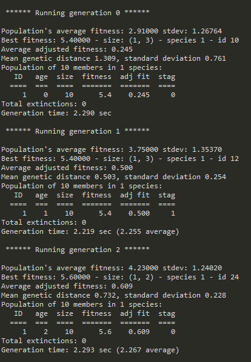

# AI Controlled Flappy Birds
AI controlled Flappy Bird using NEAT in Python

 

Built using:
- [Pygame](https://www.pygame.org/docs/)
- [NEAT](https://neat-python.readthedocs.io/en/latest/)

To play with the AI:
- Change the Population Size in the [config](https://github.com/UVE-R/Flappy-Bird-AI/blob/main/config-feedforward.txt)
- Change fitness scoring
- Add other input nodes
